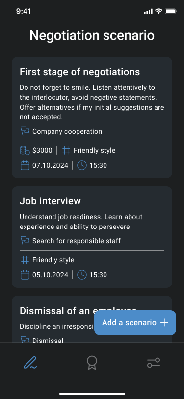
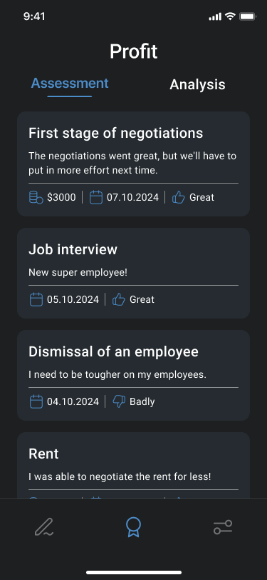
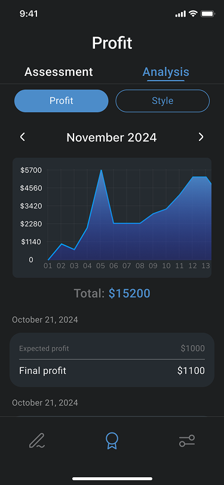

# Meeti: Success in Every Word

**Meeti** is a Flutter app that helps you improve your communication effectiveness by planning scenarios, assessing performance, and analyzing your personal style. It merges strategy, feedback, and growth in a clean and intuitive interface.


## 🛠️ Technologies

- **Flutter** and **Dart**
- **Provider** — state management
- **Flutter ScreenUtil** — responsive layout
- **Custom ThemeData** — dark theme, icons, colors
- **Local assets** — images and resources included in the project

## 📱 Screenshots

| Scenarios | Assessment | Analysis |
|-----------|-------------|----------|
|  |  |  |

## 🚀 How to Run

1. Clone the repo
   ```sh
   git clone https://github.com/NMMustafina/photo_app.git
   ```
2. Install all the packages by typing the following command
   ```sh
   flutter pub get
   ```
3. Run the App
